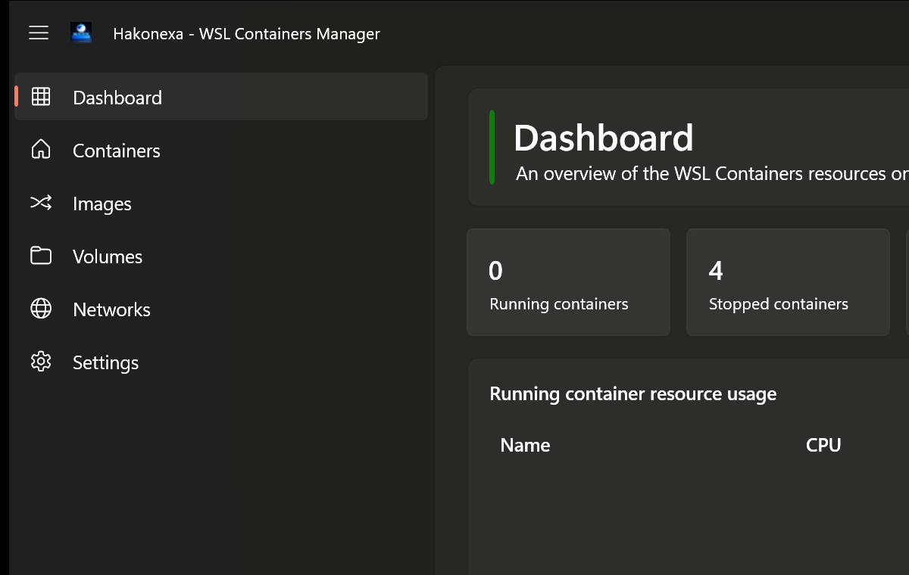

# Hakonexa - WSL Containers Manager

[English README](README.md)

Hakonexa - WSL Containers Manager は、WSL (Windows Subsystem for Linux) 上のコンテナを管理するための
WinUI / .NET デスクトップアプリケーションです。新しい **WSL Containers**
（`wslc` CLI / WSL Container API, Public Preview）を対象に、コンテナ、イメージ、ボリューム、
ネットワーク、ログ、シェル、WSLリソース設定をWindowsネイティブのUIから扱える体験を目指しています。

また、本リポジトリは .NET の Agents skill と WinUI の Agents skill を組み合わせて、GitHub Copilot app
で実際のデスクトップアプリを開発する実験的なプロジェクトでもあります。

## スクリーンショット



## 現状

このアプリは単なるスキャフォールドではなく、クリーンアーキテクチャの各プロジェクトとWinUIの主要画面を
実装済みです。

- ダッシュボードのサマリ表示と稼働中コンテナのリソース使用量表示
- コンテナ一覧、起動、停止、再起動、削除、詳細表示、ログ表示、対話的execシェル
- イメージ一覧、pull、イメージからの起動、削除
- ボリューム一覧、作成、削除
- ネットワーク一覧、作成、削除
- WSL連携状態とWSLリソース制限を扱う設定画面

管理対象のWSL ContainersはPublic Preview中のため、ランタイムの挙動やAPIは変わる可能性があります。
現在の仕様サマリと一次情報源は
[`docs/reference/wsl-containers-platform.md`](docs/reference/wsl-containers-platform.md)
を参照してください。

## アーキテクチャ

クリーンアーキテクチャを意識した4層構成を採用しています。

| 層 | 責務 |
|---|---|
| Domain | エンティティ、値オブジェクト、ドメインルール |
| Application | ユースケース、外部依存の抽象(interface) |
| Infrastructure | `wslc` CLI連携、具体的なシステムI/O |
| Presentation | WinUI View、ViewModel、ナビゲーション、ローカライズ、DI構成 |

現在の構成スナップショットは
[`docs/design/architecture-overview.md`](docs/design/architecture-overview.md)、
採用理由は [ADR-0005](docs/adr/0005-adopt-clean-architecture-layering.md) を参照してください。

## ドキュメント

| ディレクトリ | 内容 |
|---|---|
| [`docs/specs/`](docs/specs/README.md) | 個別機能の仕様書（何を作るか） |
| [`docs/design/`](docs/design/README.md) | 現在の設計の最新スナップショット |
| [`docs/adr/`](docs/adr/README.md) | 設計判断・プロセス決定の記録 (Architecture Decision Record) |
| [`docs/reference/`](docs/reference/README.md) | WSL Containers等、外部プラットフォームの仕様参照資料 |
| [`docs/privacy-policy.md`](docs/privacy-policy.md) | Microsoft Store提出用のプライバシーポリシー |

## AIコーディングエージェントでの開発

本リポジトリは GitHub Copilot CLI 等のAIコーディングエージェントを用いた開発を前提としています。
エージェント向けの運用ルール（開発フロー、TDD、ADR運用、モデルルーティング等）は
[`AGENTS.md`](AGENTS.md) にまとめています。人間のコントリビューターが同じ開発フローに従う場合も、
そちらを参照してください。

## セットアップ（Copilot CLIでの開発に必要なplugin）

このリポジトリのCopilot運用には、以下のplugin/marketplaceが必要です。未導入の環境では以下を
実行してください（Copilot CLIのユーザー設定に対する変更のため、リポジトリのクローンだけでは
再現されません）。

```powershell
copilot plugin marketplace add dotnet/skills
copilot plugin install dotnet@dotnet-agent-skills
copilot plugin install dotnet-test@dotnet-agent-skills
copilot plugin install dotnet-msbuild@dotnet-agent-skills
copilot plugin install dotnet-nuget@dotnet-agent-skills
copilot plugin install microsoftdocs/mcp
```

複数の `copilot plugin install` を同時並行で実行すると、marketplaceのgit clone処理が競合し破損する
ことがあります。必ず1つずつ順番に実行してください。

`winui`/`dotnet`（awesome-copilot marketplace）は個々の開発環境で別途導入済みである前提です。
