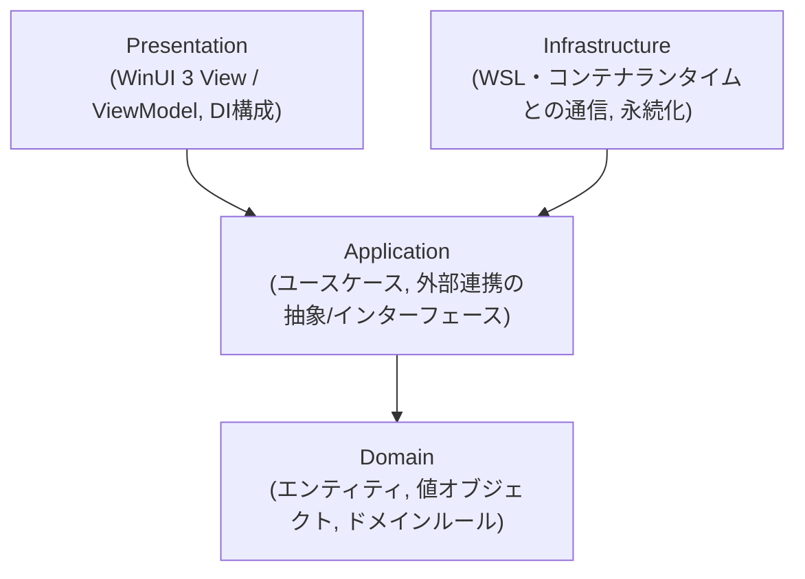

# アーキテクチャ概要

> このドキュメントは現時点のスナップショットです。経緯・検討過程は書きません。
> 採用理由は [ADR-0005](../adr/0005-adopt-clean-architecture-layering.md) を参照してください。

## 状態

プロジェクト本体（`.slnx`/各層の`.csproj`）は未作成。以下は今後の実装が従うべき構成方針。
最初の機能実装に着手した時点で、実際のプロジェクト構成に合わせてこのドキュメントを更新すること
（プレースホルダのまま放置しない）。

ソリューションファイルは、従来の `.sln` ではなく **`.slnx`**（XMLベースの新形式）を使う
（[ADR-0006](../adr/0006-adopt-slnx-solution-file-format.md)）。スキャフォールド時は
`dotnet new sln` で作成する（.NET SDK 9.0.200 以上が必要）。

## 層構成

依存は常に図の下向き（外側→内側）のみ。逆方向の依存（例: Domain が Infrastructure を参照する）は禁止。

## 各層の責務

### Domain

- コンテナ、イメージ、ボリューム、ネットワークなどのエンティティ・値オブジェクト。
- ドメインルール（例: 状態遷移の妥当性）。
- 外部フレームワーク（WinUI, WSL API等）への依存を一切持たない。

### Application

- ユースケース（例: 「コンテナを起動する」「イメージ一覧を取得する」）をアプリケーションサービスとして実装。
- Infrastructureが実装すべき抽象（インターフェース）をこの層で定義する
  （例: `IContainerRuntimeClient`）。
- Domainのみに依存する。

### Infrastructure

- WSL・コンテナランタイム（Docker Engine / containerd等、採用ランタイムは別途ADRで決定）との
  実際の通信を行うクライアント実装。
- 設定やキャッシュの永続化（ファイルI/O、レジストリ等）。
- Applicationで定義された抽象を実装する。

### Presentation

- WinUI 3のView（XAML）とViewModel（MVVM、CommunityToolkit.Mvvm想定）。
- アプリのエントリポイントとDIコンテナ構成（Infrastructureの実装をApplicationの抽象へ束縛する）。
- ViewModelはApplication層のユースケース/抽象にのみ依存し、Infrastructureの具象クラスを直接参照しない。

## テスト戦略との対応

- Domain / Application 層: MSTestによる高速な単体テスト（[ADR-0003](../adr/0003-select-mstest-as-unit-test-framework.md)）が主戦場。TDD（[ADR-0002](../adr/0002-adopt-strict-tdd-workflow.md)）はこの2層を中心に回す。
- Infrastructure層: 実際のWSL/コンテナランタイムとの結合部分。フェイク/モックを介した単体テストに加え、必要に応じ結合テストを検討する。
- Presentation層: `winui-ui-testing` skill（既存のwinui pluginが提供）によるUIオートメーションテストで検証する。

## 今後の更新予定

- プロジェクト本体のスキャフォールド時に、実際のディレクトリ構成・プロジェクト参照を反映する。
- コンテナランタイムとの通信方式（WSL API直接呼び出し / CLIラッパー等）が決まり次第、
  Infrastructure層の節を具体化する。
