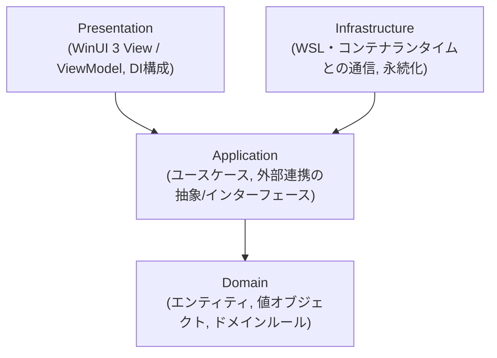

# アーキテクチャ概要

> このドキュメントは現時点のスナップショットです。経緯・検討過程は書きません。
> 採用理由は [ADR-0005](../adr/0005-adopt-clean-architecture-layering.md) を参照してください。

## 状態

`WslContainersDesktop.slnx`（[ADR-0006](../adr/0006-adopt-slnx-solution-file-format.md)）に、
以下の7プロジェクトが存在する。

| プロジェクト | 種別 | 内容 |
|---|---|---|
| `src/WslContainersDesktop.Domain` | classlib | コンテナエンティティ・状態・状態別操作可否 |
| `src/WslContainersDesktop.Application` | classlib | コンテナ管理ユースケースとInbound/Outboundポート |
| `src/WslContainersDesktop.Infrastructure` | classlib | `wslc` CLIラッパーによるWSL Containers連携 |
| `src/WslContainersDesktop.App` | WinUI3 MSIXパッケージアプリ（net10.0-windows） | Presentation層。ナビゲーション、ローカライズ、DI構成、コンテナ一覧/ログ表示を実装済み |
| `tests/WslContainersDesktop.Domain.Tests` | MSTest | Domain層の単体テスト |
| `tests/WslContainersDesktop.Application.Tests` | MSTest | Application層の単体テスト |
| `tests/WslContainersDesktop.Infrastructure.Tests` | MSTest | Infrastructure層のCLIクライアント/ランナー単体テスト |
| `tests/WslContainersDesktop.App.Tests` | MSTest | Presentation層（ナビゲーション制御・コンテナ一覧ViewModel）の単体テスト |

現在の主要な振る舞いは、コンテナ一覧取得、起動・停止・再起動・削除、ログのスナップショット表示と
ライブ追跡である。

## 層構成

依存は常に図の下向き（外側→内側）のみ。逆方向の依存（例: Domain が Infrastructure を参照する）は禁止。

## 各層の責務

### Domain

- コンテナ、イメージ、ボリューム、ネットワークなどのエンティティ・値オブジェクト。
- ドメインルール（例: 状態遷移の妥当性）。
- 外部フレームワーク（WinUI, WSL API等）への依存を一切持たない。
- 現在は`Container`と`ContainerState`を定義し、停止中/実行中に応じた起動・停止・再起動・削除の
  操作可否を`Container`に保持する。

### Application

- ユースケース（例: 「コンテナを起動する」「イメージ一覧を取得する」）をアプリケーションサービスとして実装。
- Infrastructureが実装すべき抽象（インターフェース）をこの層で定義する
  （例: `IContainerRuntimeClient`）。
- Domainのみに依存する。
- `IContainerManagementService`はPresentation層向けのInboundポートであり、一覧取得、起動・停止・
  再起動・削除、既存ログ取得、ライブログ追跡を提供する。
- `ContainerManagementService`は操作前に`IContainerRuntimeClient.ListContainersAsync`で対象コンテナの
  存在と状態を検証する。再起動は`wslc`のサブコマンドではなく停止→起動として扱うが、停止中コンテナを
  起動にすり替えない。
- `IContainerRuntimeClient`はInfrastructure層向けのOutboundポートであり、CLI/SDKなど具体的な
  ランタイム連携方式をApplication層から隠蔽する。

### Infrastructure

- WSL・コンテナランタイム（Docker Engine / containerd等、採用ランタイムは別途ADRで決定）との
  実際の通信を行うクライアント実装。
  - 具体的な統合対象は **WSL Containers**（`wslc` CLI / WSL Container API）。
    仕様サマリは [`docs/reference/wsl-containers-platform.md`](../reference/wsl-containers-platform.md) を参照。
- 設定やキャッシュの永続化（ファイルI/O、レジストリ等）。
- Applicationで定義された抽象を実装する。
- 現在は [ADR-0009](../adr/0009-wrap-wslc-cli-for-infrastructure-layer.md) に基づき、
  `WslcCliContainerRuntimeClient`が`wslc` CLIを呼び出して`IContainerRuntimeClient`を実装する。
- `IWslcCliRunner.RunAsync`は短時間で終了するCLI呼び出しの標準出力/標準エラーをまとめて取得する。
  `IWslcCliRunner.StreamLinesAsync`は`wslc container logs --since <unix-epoch> --follow`のような長時間実行コマンドの
  stdout/stderrを行単位でストリーミングする。実プロセス起動は`IWslcProcessFactory`/`IWslcProcess`で
  抽象化し、単体テストは実際の`wslc.exe`に依存しない。

### Presentation

- WinUI 3のView（XAML）とViewModel（MVVM、CommunityToolkit.Mvvm使用）。
- アプリのエントリポイントとDIコンテナ構成（Infrastructureの実装をApplicationの抽象へ束縛する）。
  `App.xaml.cs`をComposition Rootとし、`Microsoft.Extensions.DependencyInjection`でApplicationの抽象と
  Infrastructure実装を結びつける（[ADR-0010](../adr/0010-adopt-di-container-for-presentation.md)）。
- ViewModelはApplication層のユースケース/抽象にのみ依存し、Infrastructureの具象クラスを直接参照しない。
- ナビゲーション基盤・ローカライズ基盤の詳細は
  [`docs/design/presentation-navigation.md`](presentation-navigation.md) を参照。
- コンテナ一覧ViewModelの状態管理とログ表示の詳細は
  [`docs/design/containers-view.md`](containers-view.md) を参照。

## テスト戦略との対応

- Domain / Application 層: MSTestによる高速な単体テスト（[ADR-0003](../adr/0003-select-mstest-as-unit-test-framework.md)）が主戦場。TDD（[ADR-0002](../adr/0002-adopt-strict-tdd-workflow.md)）はこの2層を中心に回す。
- Infrastructure層: 実際のWSL/コンテナランタイムとの結合部分。フェイク/モックを介した単体テストに加え、必要に応じ結合テストを検討する。
- Presentation層: ナビゲーション制御ロジック（ViewModel等）はMSTestの単体テストで検証し、
  実際の画面切り替え・起動/終了の挙動は`winui-ui-testing` skill（既存のwinui pluginが提供）による
  UIオートメーションテストで検証する。
