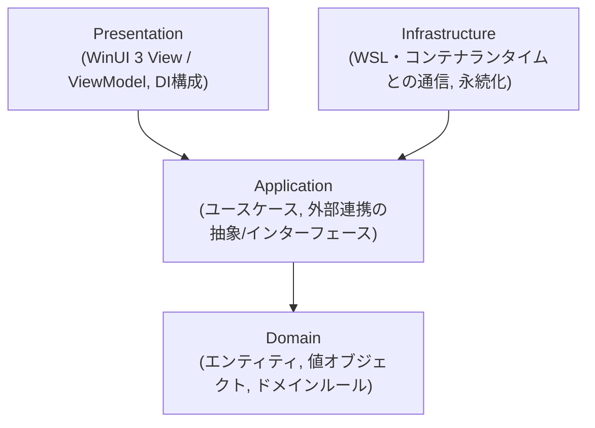

# アーキテクチャ概要

> このドキュメントは現時点のスナップショットです。経緯・検討過程は書きません。
> 採用理由は [ADR-0005](../adr/0005-adopt-clean-architecture-layering.md) を参照してください。

## 状態

`WslContainersDesktop.slnx`（[ADR-0006](../adr/0006-adopt-slnx-solution-file-format.md)）に、
以下の7プロジェクトが存在する。

| プロジェクト | 種別 | 内容 |
|---|---|---|
| `src/WslContainersDesktop.Domain` | classlib | コンテナ/イメージ/ボリューム/ネットワークエンティティ・状態・詳細情報値オブジェクト・状態別操作可否 |
| `src/WslContainersDesktop.Application` | classlib | コンテナ/イメージ/ボリューム/ネットワーク管理ユースケース、execセッション抽象、Inbound/Outboundポート |
| `src/WslContainersDesktop.Infrastructure` | classlib | `wslc` CLIラッパーによるWSL Containers連携 |
| `src/WslContainersDesktop.App` | WinUI3 MSIXパッケージアプリ（net10.0-windows） | Presentation層。ナビゲーション、ローカライズ、DI構成、コンテナ一覧/詳細/ログ/シェル表示、イメージ一覧/pull/削除、ボリューム一覧/作成/削除、ネットワーク一覧/作成/削除を実装済み |
| `tests/WslContainersDesktop.Domain.Tests` | MSTest | Domain層の単体テスト |
| `tests/WslContainersDesktop.Application.Tests` | MSTest | Application層の単体テスト |
| `tests/WslContainersDesktop.Infrastructure.Tests` | MSTest | Infrastructure層のCLIクライアント/ランナー単体テスト |
| `tests/WslContainersDesktop.App.Tests` | MSTest | Presentation層（ナビゲーション制御・コンテナ/イメージ/ボリューム/ネットワーク一覧ViewModel）の単体テスト |

現在の主要な振る舞いは、コンテナ一覧取得、起動・停止・再起動・削除、詳細情報表示、ログの
スナップショット表示とライブ追跡、稼働中コンテナへの対話的execシェル、イメージ一覧取得、
イメージpull、イメージ削除、ボリューム一覧取得、ボリューム作成、ボリューム削除、
ネットワーク一覧取得、ネットワーク作成、ネットワーク削除である。

## 層構成

依存は常に図の下向き（外側→内側）のみ。逆方向の依存（例: Domain が Infrastructure を参照する）は禁止。

## 各層の責務

### Domain

- コンテナ、イメージ、ボリューム、ネットワークなどのエンティティ・値オブジェクト。
- ドメインルール（例: 状態遷移の妥当性）。
- 外部フレームワーク（WinUI, WSL API等）への依存を一切持たない。
- 現在は`Container`と`ContainerState`を定義し、停止中/実行中に応じた起動・停止・再起動・削除の
  操作可否を`Container`に保持する。
- `ContainerDetail`はコンテナID、名前、イメージ、状態、作成日時、実行コマンド、エントリポイント、
  ポートマッピング、環境変数、マウント、ネットワーク、直近の実行状態を保持する。
- `ContainerImage`はローカルイメージのID、リポジトリ、タグ、サイズ、作成日時を保持し、untaggedを含む
  表示名を`DisplayName`として提供する。
- `ContainerVolume`はローカルボリュームの名前、ドライバー、作成日時、参照中コンテナ名を保持し、
  参照有無に応じた削除可否を提供する。
- `ContainerNetworkResource`はコンテナーネットワークの名前、ドライバー、作成日時、
  接続中コンテナ名、システムネットワークかどうかを保持し、接続有無とシステム種別に応じた
  削除可否を提供する。

### Application

- ユースケース（例: 「コンテナを起動する」「イメージ一覧を取得する」）をアプリケーションサービスとして実装。
- Infrastructureが実装すべき抽象（インターフェース）をこの層で定義する
  （例: `IContainerRuntimeClient`）。
- Domainのみに依存する。
- `IContainerManagementService`はPresentation層向けのInboundポートであり、一覧取得、起動・停止・
  再起動・削除、詳細取得、既存ログ取得、ライブログ追跡、対話的execセッション開始を提供する。
- `ContainerManagementService`は操作前に`IContainerRuntimeClient.ListContainersAsync`で対象コンテナの
  存在と状態を検証する。再起動は`wslc`のサブコマンドではなく停止→起動として扱うが、停止中コンテナを
  起動にすり替えない。execセッション開始は実行中コンテナにだけ許可する。
- `IContainerRuntimeClient`はInfrastructure層向けのOutboundポートであり、CLI/SDKなど具体的な
  ランタイム連携方式をApplication層から隠蔽する。コンテナ操作に加えて、詳細取得、execセッション開始、
  イメージ一覧取得、pull、削除のランタイム呼び出しもこのポートに集約する。
- `IContainerExecSession`は対話的execセッションの抽象であり、出力チャンクの読み取り、コマンド送信、
  明示的な切断、切断状態を提供する。
- `IImageManagementService`はPresentation層向けのInboundポートであり、イメージ一覧取得、pull、
  削除を提供する。pull後の一覧更新や削除確認はPresentation層で扱い、Application層はランタイム操作の
  オーケストレーションと入力検証に留める。
- `IVolumeManagementService`はPresentation層向けのInboundポートであり、ボリューム一覧取得、作成、
  削除を提供する。`VolumeManagementService`は一覧取得時にコンテナ詳細のマウント情報から参照中
  コンテナ名を推定し、削除前にも再評価して参照中ボリュームの削除を拒否する。
- `INetworkManagementService`はPresentation層向けのInboundポートであり、ネットワーク一覧取得、作成、
  削除を提供する。`NetworkManagementService`は一覧取得時にコンテナ詳細のネットワーク情報から接続中
  コンテナ名を推定し、予約済みネットワーク名（`bridge`, `host`, `none`）をシステムネットワークとして
  扱う。削除前にも再評価して、システムネットワークと接続中ネットワークの削除を拒否する。

### Infrastructure

- WSL・コンテナランタイム（Docker Engine / containerd等、採用ランタイムは別途ADRで決定）との
  実際の通信を行うクライアント実装。
  - 具体的な統合対象は **WSL Containers**（`wslc` CLI / WSL Container API）。
    仕様サマリは [`docs/reference/wsl-containers-platform.md`](../reference/wsl-containers-platform.md) を参照。
- 設定やキャッシュの永続化（ファイルI/O、レジストリ等）。
- Applicationで定義された抽象を実装する。
- 現在は [ADR-0009](../adr/0009-wrap-wslc-cli-for-infrastructure-layer.md) に基づき、
  `WslcCliContainerRuntimeClient`が`wslc` CLIを呼び出して`IContainerRuntimeClient`を実装する。
- イメージ一覧は`wslc image list --format json --no-trunc`のJSONを`ContainerImage`へ変換する。
  pullは`wslc pull <image>`、削除は`wslc image remove <image>`を呼び出す。削除時は強制削除フラグを
  付けず、参照中イメージの拒否は`wslc`のエラーとしてApplication/Presentation層へ伝播する。
- ボリューム一覧は`wslc volume list --format json`のJSONを基点に、各ボリュームの
  `wslc volume inspect <name>`から作成日時を補完して`ContainerVolume`へ変換する。作成は
  `wslc volume create <name>`、削除は`wslc volume remove <name>`を呼び出す。削除時は強制削除フラグを
  付けず、ランタイム側の拒否はApplication/Presentation層へ伝播する。
- ネットワーク一覧は`wslc network list --format json`のJSONを基点に、各ネットワークの
  `wslc network inspect <name>`から取得できる詳細を補完して`ContainerNetworkResource`へ変換する。
  作成日時が取得できない場合は未設定値として扱い、Presentation層では`Unknown`として表示する。
  システムネットワーク判定は、ランタイムが返す種別情報とApplication層の予約済みネットワーク名
  （`bridge`, `host`, `none`）の判定を組み合わせる。作成は`wslc network create <name>`、削除は
  `wslc network remove <name>`を呼び出す。削除時は強制削除フラグを付けず、ランタイム側の拒否は
  Application/Presentation層へ伝播する。
- コンテナ詳細は`wslc container inspect <container-id>`のJSON配列を`ContainerDetail`へ変換する。
- execシェルは`wslc container exec -i <container-id> /bin/sh`を対話プロセスとして起動する。
  標準入力はLFでコマンドを終端してフラッシュし、標準出力/標準エラーは行ではなくチャンク単位で
  読み取る。プロセス終了は通常の切断状態として扱う。
- `IWslcCliRunner.RunAsync`は短時間で終了するCLI呼び出しの標準出力/標準エラーをまとめて取得する。
  `IWslcCliRunner.StreamLinesAsync`は`wslc container logs --since <unix-epoch> --follow`のような長時間実行コマンドの
  stdout/stderrを行単位でストリーミングする。実プロセス起動は`IWslcProcessFactory`/`IWslcProcess`で
  抽象化し、単体テストは実際の`wslc.exe`に依存しない。対話プロセスは`IWslcInteractiveProcess`で
  抽象化する。

### Presentation

- WinUI 3のView（XAML）とViewModel（MVVM、CommunityToolkit.Mvvm使用）。
- アプリのエントリポイントとDIコンテナ構成（Infrastructureの実装をApplicationの抽象へ束縛する）。
  `App.xaml.cs`をComposition Rootとし、`Microsoft.Extensions.DependencyInjection`でApplicationの抽象と
  Infrastructure実装を結びつける（[ADR-0010](../adr/0010-adopt-di-container-for-presentation.md)）。
- ViewModelはApplication層のユースケース/抽象にのみ依存し、Infrastructureの具象クラスを直接参照しない。
- ナビゲーション基盤・ローカライズ基盤の詳細は
  [`docs/design/presentation-navigation.md`](presentation-navigation.md) を参照。
- コンテナ一覧ViewModelの状態管理とログ表示の詳細は
  [`docs/design/containers-view.md`](containers-view.md) を参照。
- イメージ一覧ViewModelの状態管理の詳細は [`docs/design/images-view.md`](images-view.md) を参照。
- ボリューム一覧ViewModelの状態管理の詳細は [`docs/design/volumes-view.md`](volumes-view.md) を参照。
- ネットワーク一覧ViewModelの状態管理の詳細は [`docs/design/networks-view.md`](networks-view.md) を参照。

## テスト戦略との対応

- Domain / Application 層: MSTestによる高速な単体テスト（[ADR-0003](../adr/0003-select-mstest-as-unit-test-framework.md)）が主戦場。TDD（[ADR-0002](../adr/0002-adopt-strict-tdd-workflow.md)）はこの2層を中心に回す。
- Infrastructure層: 実際のWSL/コンテナランタイムとの結合部分。フェイク/モックを介した単体テストに加え、必要に応じ結合テストを検討する。
- Presentation層: ナビゲーション制御ロジック（ViewModel等）はMSTestの単体テストで検証し、
  実際の画面切り替え・起動/終了の挙動は`winui-ui-testing` skill（既存のwinui pluginが提供）による
  UIオートメーションテストで検証する。
